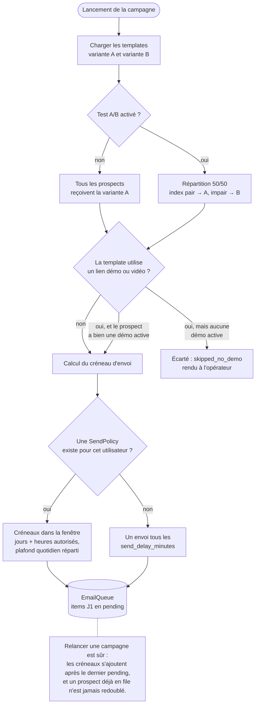
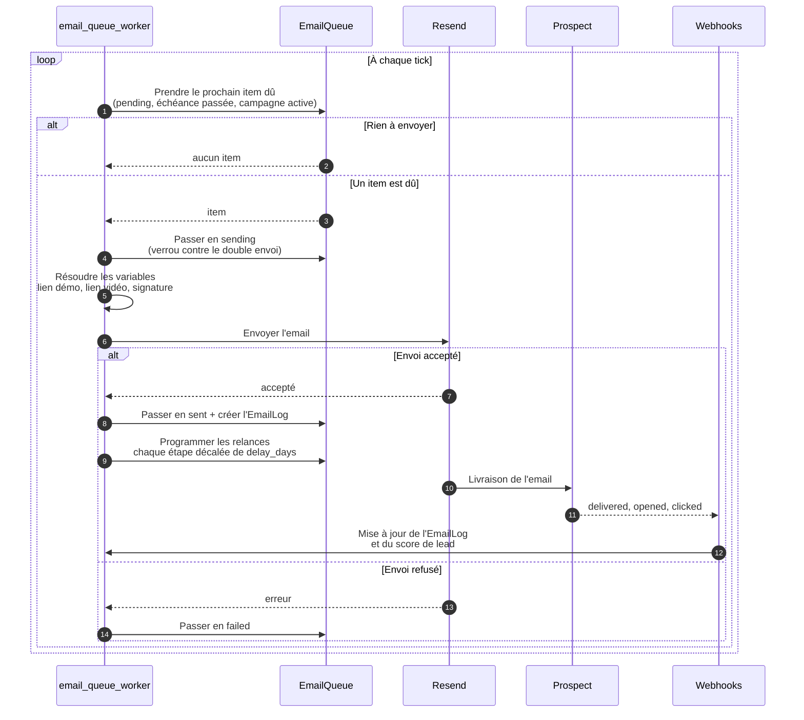
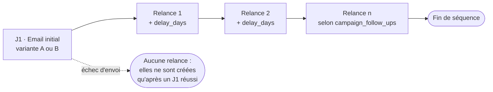

# Cycle de vie d'une campagne email

De la mise en file à la relance, en passant par le test A/B et la fenêtre d'envoi.
La logique vit dans `api/services/campaign_queue_service.py`, tournée en boucle par
`api/services/email_queue_worker.py`.

## Mise en file au lancement

## Dépilement par le worker

## Séquence vue côté prospect

Chaque relance hérite de la variante A/B de son J1, ce qui garde le test cohérent
sur toute la séquence. Les étapes viennent de `campaign_follow_ups` ; un repli sur
les anciens champs `follow_up_template_id` / `follow_up_delay_days` couvre les
campagnes créées avant la relance multi-étapes.
