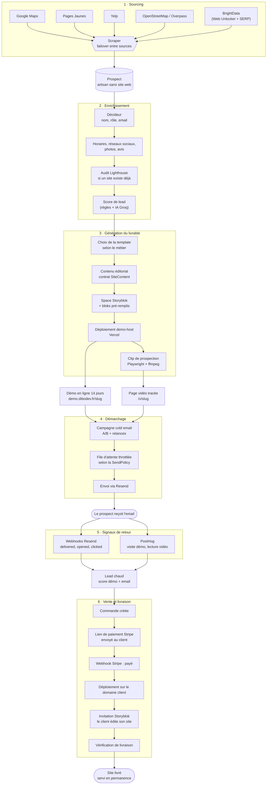
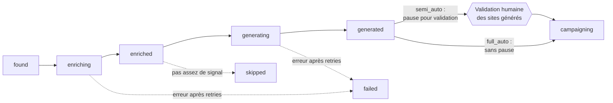

# Pipeline métier — du prospect à la vente

Chaîne complète : trouver un artisan sans site, l'enrichir, lui générer un site de
démonstration, le démarcher, encaisser, livrer.

Les étapes grisées sont **automatisables en séquence** par l'orchestrateur
d'acquisition (`api/services/acquisition_orchestrator.py`). En mode `semi_auto`
la séquence s'arrête avant le démarchage pour validation humaine ; en `full_auto`
elle enchaîne jusqu'à la campagne.

## Ce que la machine fait seule, et ce qui reste humain

`campaigning`, `skipped` et `failed` sont terminaux : l'orchestrateur n'y revient plus.
